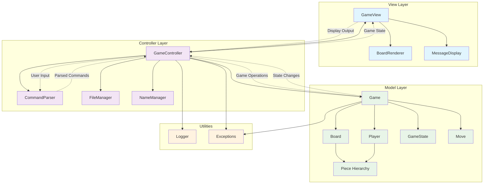
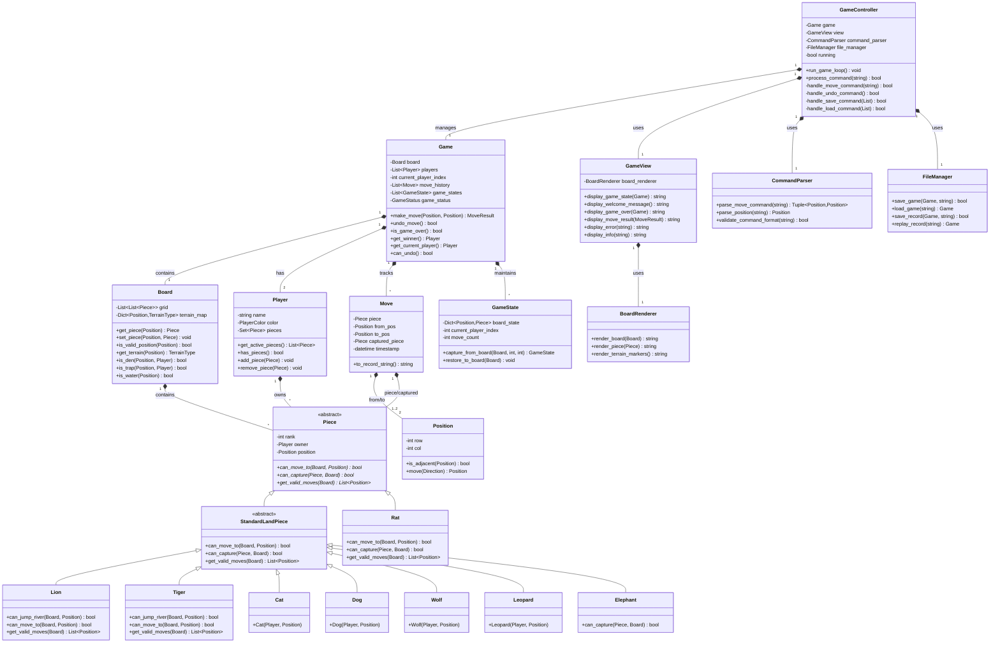
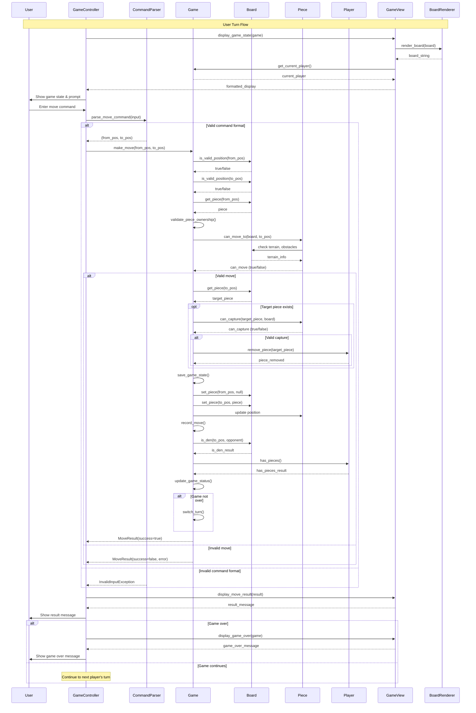

# Design Document

## Overview

The Jungle Game implementation follows the Model-View-Controller (MVC) architectural pattern to ensure clear separation of concerns, maintainability, and testability. The system is designed as a command-line application that manages game state, enforces rules, and provides file-based persistence for game records and save states.

The core design principles include:
- Object-oriented design with clear class hierarchies
- Separation of game logic (model) from user interface (view) and input handling (controller)
- Immutable game state transitions for reliable undo functionality
- Extensible architecture supporting different piece types and board configurations
- Robust error handling and input validation

## 1. Game Architecture Diagram

The Jungle Game follows the **Model-View-Controller (MVC)** architectural pattern, which provides clear separation of concerns and enables maintainable, testable code.



### Why MVC was chosen:
- **Separation of Concerns**: Game logic, user interface, and input handling are cleanly separated
- **Testability**: The model can be unit tested independently of the UI
- **Maintainability**: Changes to game rules don't affect the UI, and UI changes don't affect game logic
- **Extensibility**: New features can be added to specific layers without affecting others

### Component Instantiation:

**Model**: Contains all game logic, rules, and state management
- `Game` class: Central game state and rule enforcement
- `Board` class: Board representation and piece management
- `Piece` hierarchy: Animal pieces with specific behaviors
- `Player` class: Player information and piece ownership
- `GameState` class: Immutable snapshots for undo functionality

**View**: Handles all output and display formatting
- `GameView` class: Formats and displays game state
- `BoardRenderer` class: Renders the board with pieces and terrain
- `MessageDisplay` class: Handles user messages and prompts

**Controller**: Manages user input and coordinates between model and view
- `GameController` class: Main game loop and command processing
- `CommandParser` class: Parses and validates user input
- `FileManager` class: Handles save/load and record operations

## 2. Structure and Relationships Among Main Code Components

This diagram shows the detailed class structure and relationships within the Jungle Game system:



### Key Relationships Explained:

**Composition Relationships** (strong ownership):
- `Game` contains `Board`, `Players`, `Moves`, and `GameStates`
- `Board` contains `Pieces` at specific positions
- `Player` owns multiple `Pieces`
- `GameController` manages the `Game` and uses `View` components

**Inheritance Relationships**:
- All animal pieces inherit from `Piece` abstract base class
- Most land animals inherit from `StandardLandPiece` for common behavior
- `Rat`, `Lion`, and `Tiger` have special behaviors requiring direct `Piece` inheritance

**Dependency Relationships**:
- Controllers depend on Models for game logic
- Views depend on Models for display data
- All components use supporting classes like `Position` and `Move`

## 3. User Turn Sequence Diagram

This diagram illustrates the complete flow of events during a user's turn, from input to game state update:



### Key Phases Explained:

**1. Display Phase**:
- Controller requests current game state from View
- View renders board using BoardRenderer
- Current player information is displayed
- User sees complete game state and input prompt

**2. Input Processing Phase**:
- User enters move command
- CommandParser validates and parses input format
- Invalid format results in immediate error feedback

**3. Move Validation Phase**:
- Game validates position bounds using Board
- Game checks piece ownership and existence
- Piece validates move legality using Board terrain information
- Complex validation includes terrain restrictions and piece-specific rules

**4. Move Execution Phase**:
- Game saves current state for undo functionality
- Capture logic executed if target piece exists
- Board state updated with new piece positions
- Move recorded in game history

**5. Game State Update Phase**:
- Victory conditions checked (den reached, all pieces captured)
- Game status updated if victory achieved
- Turn switched to next player if game continues

**6. Feedback Phase**:
- Move result displayed to user
- Game over message shown if applicable
- System ready for next turn or game end actions

This sequence ensures complete validation, proper state management, and comprehensive user feedback throughout each turn.

## Components and Interfaces

### Model Package Components

#### Core Game Classes

```python
class Game:
    """Central game state manager and rule enforcer"""
    - board: Board
    - players: List[Player]
    - current_player_index: int
    - move_history: List[Move]
    - game_states: List[GameState]  # For undo functionality
    - game_status: GameStatus
    
    + make_move(from_pos: Position, to_pos: Position) -> MoveResult
    + undo_move() -> bool
    + is_game_over() -> bool
    + get_winner() -> Optional[Player]
    + get_current_player() -> Player
    + can_undo() -> bool

class Board:
    """7x9 game board with terrain and piece management"""
    - grid: List[List[Optional[Piece]]]
    - terrain_map: Dict[Position, TerrainType]
    
    + get_piece(pos: Position) -> Optional[Piece]
    + set_piece(pos: Position, piece: Optional[Piece]) -> None
    + is_valid_position(pos: Position) -> bool
    + get_terrain(pos: Position) -> TerrainType
    + is_den(pos: Position, player: Player) -> bool
    + is_trap(pos: Position, player: Player) -> bool
    + is_water(pos: Position) -> bool

class Player:
    """Player information and piece ownership"""
    - name: str
    - color: PlayerColor
    - pieces: Set[Piece]
    
    + get_active_pieces() -> List[Piece]
    + has_pieces() -> bool
    + remove_piece(piece: Piece) -> None
```

#### Piece Hierarchy

```python
class Piece(ABC):
    """Abstract base class for all game pieces"""
    - rank: int
    - owner: Player
    - position: Position
    
    + can_move_to(board: Board, target: Position) -> bool
    + can_capture(target_piece: Piece, board: Board) -> bool
    + get_valid_moves(board: Board) -> List[Position]

class Rat(Piece):
    """Rank 1 - Can move in water, special capture rules"""
    + can_move_to(board: Board, target: Position) -> bool
    + can_capture(target_piece: Piece, board: Board) -> bool

class Cat(Piece):
    """Rank 2 - Standard land animal"""
    
class Dog(Piece):
    """Rank 3 - Standard land animal"""

class Wolf(Piece):
    """Rank 4 - Standard land animal"""

class Leopard(Piece):
    """Rank 5 - Standard land animal"""

class Tiger(Piece):
    """Rank 6 - Can jump over rivers"""
    + can_jump_river(board: Board, target: Position) -> bool

class Lion(Piece):
    """Rank 7 - Can jump over rivers"""
    + can_jump_river(board: Board, target: Position) -> bool

class Elephant(Piece):
    """Rank 8 - Cannot be captured by rat"""
    + can_capture(target_piece: Piece, board: Board) -> bool
```

#### Supporting Classes

```python
class Position:
    """Immutable position representation"""
    - row: int
    - col: int
    
    + is_adjacent(other: Position) -> bool
    + get_direction(other: Position) -> Direction
    + __eq__, __hash__, __str__

class Move:
    """Immutable move record"""
    - piece: Piece
    - from_pos: Position
    - to_pos: Position
    - captured_piece: Optional[Piece]
    - timestamp: datetime

class GameState:
    """Immutable game state snapshot for undo"""
    - board_state: Dict[Position, Optional[Piece]]
    - current_player_index: int
    - move_count: int
    
    + restore_to_game(game: Game) -> None

class GameStatus(Enum):
    ONGOING = "ongoing"
    PLAYER_ONE_WINS = "player_one_wins"
    PLAYER_TWO_WINS = "player_two_wins"
    DRAW = "draw"
```

### View Package Components

```python
class GameView:
    """Main view coordinator"""
    - board_renderer: BoardRenderer
    - message_display: MessageDisplay
    
    + display_game_state(game: Game) -> None
    + display_welcome_message() -> None
    + display_game_over(winner: Optional[Player]) -> None

class BoardRenderer:
    """Handles board visualization"""
    + render_board(board: Board) -> str
    + render_piece(piece: Optional[Piece]) -> str
    + render_terrain_markers() -> str

class MessageDisplay:
    """Handles user messages and prompts"""
    + show_error(message: str) -> None
    + show_info(message: str) -> None
    + prompt_for_input(prompt: str) -> str
```

### Controller Package Components

```python
class GameController:
    """Main game controller and command processor"""
    - game: Game
    - view: GameView
    - command_parser: CommandParser
    - file_manager: FileManager
    
    + run_game_loop() -> None
    + process_command(command: str) -> bool
    + handle_move_command(args: List[str]) -> None
    + handle_save_command(filename: str) -> None
    + handle_load_command(filename: str) -> None

class CommandParser:
    """Parses and validates user input"""
    + parse_move_command(input_str: str) -> Tuple[Position, Position]
    + parse_position(pos_str: str) -> Position
    + validate_command_format(command: str) -> bool

class FileManager:
    """Handles file operations for save/load and records"""
    + save_game(game: Game, filename: str) -> bool
    + load_game(filename: str) -> Optional[Game]
    + save_record(game: Game, filename: str) -> bool
    + load_record(filename: str) -> Optional[List[Move]]
```

## Data Models

### Core Data Structures

```python
# Enumerations
class TerrainType(Enum):
    LAND = "land"
    WATER = "water"
    DEN = "den"
    TRAP = "trap"

class PlayerColor(Enum):
    RED = "red"
    BLUE = "blue"

class Direction(Enum):
    NORTH = (-1, 0)
    SOUTH = (1, 0)
    EAST = (0, 1)
    WEST = (0, -1)

# Data Transfer Objects
@dataclass
class MoveResult:
    success: bool
    message: str
    captured_piece: Optional[Piece] = None

@dataclass
class GameConfig:
    board_width: int = 7
    board_height: int = 9
    max_undo_moves: int = 3
    player_names: List[str] = field(default_factory=lambda: ["Player 1", "Player 2"])
```

### File Format Specifications

**Save File Format (.jungle):**
```json
{
    "version": "1.0",
    "players": [
        {"name": "Player 1", "color": "red"},
        {"name": "Player 2", "color": "blue"}
    ],
    "current_player": 0,
    "board_state": {
        "0,0": {"piece": "elephant", "owner": "red"},
        "0,6": {"piece": "elephant", "owner": "blue"}
    },
    "move_history": [
        {
            "piece": "rat",
            "from": "2,0",
            "to": "3,0",
            "captured": null,
            "timestamp": "2024-01-01T10:00:00"
        }
    ],
    "game_status": "ongoing"
}
```

**Record File Format (.record):**
```
JUNGLE_GAME_RECORD_V1.0
Players: Player 1 (Red), Player 2 (Blue)
Start Time: 2024-01-01 10:00:00
Move 1: Player 1 - Rat from (2,0) to (3,0)
Move 2: Player 2 - Cat from (2,6) to (3,6)
...
Game Result: Player 1 Wins - Reached opponent's den
End Time: 2024-01-01 10:15:30
```

## Error Handling

### Exception Hierarchy

```python
class JungleGameException(Exception):
    """Base exception for all game-related errors"""

class InvalidMoveException(JungleGameException):
    """Raised when a move violates game rules"""

class InvalidPositionException(JungleGameException):
    """Raised when position is outside board bounds"""

class GameOverException(JungleGameException):
    """Raised when attempting to play after game ends"""

class FileOperationException(JungleGameException):
    """Raised when file save/load operations fail"""
```

### Error Handling Strategy

1. **Input Validation**: All user inputs are validated before processing
2. **Graceful Degradation**: Invalid commands show helpful error messages
3. **State Consistency**: Game state remains consistent even after errors
4. **File Operation Safety**: Backup existing files before overwriting
5. **Recovery Mechanisms**: Undo functionality helps recover from mistakes

## Testing Strategy

### Unit Testing Approach

**Model Testing (Primary Focus):**
- **Piece Movement Tests**: Validate each piece type's movement rules
- **Capture Logic Tests**: Test all capture scenarios including special cases
- **Board State Tests**: Verify board initialization and state management
- **Game Flow Tests**: Test turn management and game ending conditions
- **Undo Functionality Tests**: Validate state restoration accuracy
- **File Operations Tests**: Test save/load and record functionality

**Test Categories:**

1. **Rule Enforcement Tests**
   - Valid/invalid moves for each piece type
   - Capture rules including rank-based and special cases
   - Water movement restrictions
   - River jumping mechanics
   - Trap and den interactions

2. **Game State Management Tests**
   - Turn switching
   - Victory condition detection
   - Undo/redo functionality
   - Game state serialization

3. **Edge Case Tests**
   - Boundary position handling
   - Multiple piece interactions
   - Complex capture scenarios
   - File corruption handling

**Testing Framework**: Python's built-in `unittest` framework
**Coverage Target**: 90%+ line coverage for the model package
**Test Data**: Predefined board states and move sequences for consistent testing

### Integration Testing

- **Controller-Model Integration**: Test command processing and game state updates
- **File System Integration**: Test save/load operations with actual files
- **View-Model Integration**: Test display formatting with various game states

### Test Automation

- All tests executable via `python -m unittest discover`
- Continuous integration setup for automated test execution
- Coverage reporting using `coverage.py` tool
- Test data fixtures for consistent test scenarios